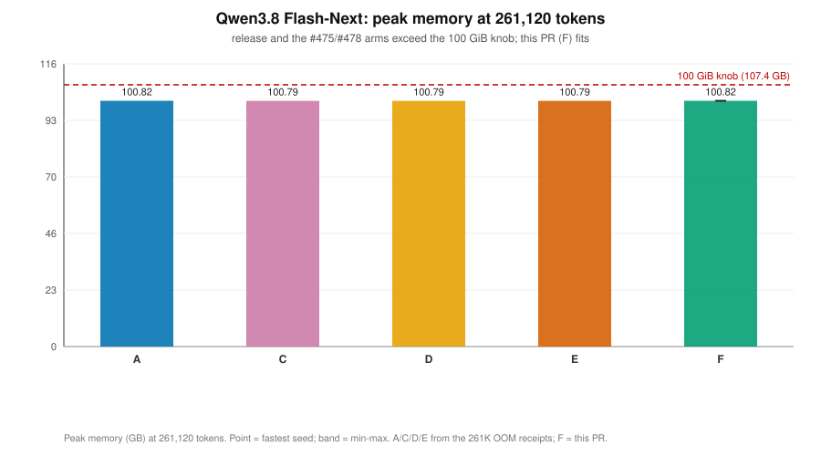
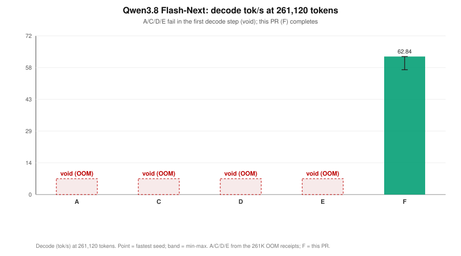

# Qwen3.8 Flash-Next: 261,120-token decode fix

Two verify-step memory fixes on top of upstream MTPLX 2.11.2 (`21be78b3`). At the pack's
advertised 261,120-token context the release reads the whole prompt and then runs out of GPU
memory in the first decode step. With both commits the same prompt decodes to completion on
every seed, with native MTP on, at a 100.82 GB peak against the 107.374 GB (100 GiB) knob.

| # | Commit | Optimization | Exactness |
| --- | --- | --- | --- |
| 1 | `fc0d2a29` | In-place verify KV write (`mtplx/graphbank.py`) | exact; same bytes as `mx.slice_update` |
| 2 | `e0ebdc41` | Head-chunked verify SDPA (`mtplx/models/qwen4_exp.py`) | bit-identical to an unchunked fused call; rounding-class against the unfused route it replaces |

## 261,120 tokens

Release 2.11.2 fails this cell: prompt fully read (`new_prefill_tokens` 261120), time to first
token 243.5 s, then `completion_tokens` 12 and `finish_reason` `error`, at a 100.82 GB sampled
peak, with `[METAL] Command buffer execution failed: Insufficient Memory`.

The fix arm completes it on three cold seeds, one seed per server load:

| Window | Seed | Prefill tok/s | Decode tok/s | TTFT (s) | Wall (s) | Completion tokens | Finish | Accept | Peak (GB) |
| --- | --- | ---: | ---: | ---: | ---: | ---: | --- | ---: | ---: |
| w1 | 20260829 | 1081.6 | 59.62 | 242.631 | 254.03 | 461 | stop | 0.499 | 100.82 |
| w2 | 20260830 | 1081.5 | 56.82 | 242.614 | 264.33 | 1024 | length | 0.483 | 100.82 |
| w3 | 20260831 | 1082.9 | 62.84 | 242.290 | 259.43 | 845 | stop | 0.563 | 100.82 |

Fastest of the three, with the min-max: prefill **1082.9** tok/s (1081.5-1082.9), decode
**62.84** tok/s (56.82-62.84), TTFT **242.290** s (242.290-242.631), wall **254.03** s
(254.03-264.33), peak **100.82** GB (100.82-100.82). Every window sits about 6.5 GB under the
knob. Completion tokens differ by seed because each seed stops on its own; no window errored.

## 16,384 tokens (no regression)

This cell never overflowed, so it measures that the token rate and the output are unchanged.

| Metric | release 2.11.2 (A) | fix arm (F) |
| --- | ---: | ---: |
| Decode tok/s (fastest, min-max) | 71.97 | 71.61 (71.24-71.61) |
| Decode tok/s (mean of windows) | 71.58 | 71.47 |
| Prefill tok/s | 1381.5 | 1377.2 (1343.5-1377.2) |
| TTFT (s) | 12.056 | 12.112 (12.112-12.390) |
| Peak memory (GB) | 93.41 | 93.41 (89.01-93.41) |
| Output vs release | — | byte-identical, all 3 seeds |

The output check is `text_sha256` per seed against the release arm's own 16,384-token windows:

| Seed | Completion tokens | `text_sha256` (both arms) |
| --- | ---: | --- |
| 20260829 | 1024 | `ee9993ec5b08201d6af3fa06c3367fd60e88ae7480d4df21c6911b590d6752f5` |
| 20260830 | 689 | `eec89cc6af7d9bc8fc7ea69cdcf29448d54c722238582d8050d6f79ec6c34564` |
| 20260831 | 879 | `1ac58119b2df27d732bfe266d97086ed21e2c4dd4a8e644b8ad07466400f8315` |

## Evidence chain

The prefill is not what overflows: on every failing arm the whole prompt is read and tokens are
already emitted before the failure. The overflow is the first decode step, the fixed four-row
speculative verify, which makes two per-layer allocations across the 12 full-attention layers
(48 layers, `full_attention_interval` 4).

1. **Native MTP off (W5).** Decode becomes plain autoregressive at query length 1: the fused
   attention kernel is eligible so no score plane is built, and the stock in-place `KVCache`
   runs instead of `TensorOffsetKVCache`. The same 261,120-token prompt **fits at 94.19 GB** and
   decodes 547 tokens to a normal `stop`, TTFT 223.6 s. With MTP on the peak is 100.82 GB. The
   6.4 GB gap is what the verify adds, but turning MTP off removes both candidate terms at once.
2. **Head chunk alone (`e0ebdc41`, no in-place write).** The head chunk engaged
   (`/health` `verify_sdpa_head_chunk` `{engaged: true, q_len: 5, heads_per_chunk: 6, chunks: 4,
   n_kv_heads: 2}`), so the `[24, S, 261120]` score plane was not built. The request still failed
   at the same place and the same peak: TTFT 242.44 s, 12 tokens, `error`, 100.82 GB, against
   release's 100.82 GB. A peak unchanged to two decimals with the attention transient provably
   gone isolates the remaining 6.4 GB to something other than attention.
3. **Allocation probe.** Probing `TensorOffsetKVCache` at this geometry (context 261,120,
   capacity 261,128, 12 layers, 5 verify rows) measures one KV buffer at **0.27 GB**, resident KV
   across keys, values and the 12 layers at **6.42 GB**, and, with the in-place write, an
   **update transient above resident of 0.00 GB**. Unfixed, that transient is the full 6.4 GB
   again: `mx.slice_update` returns a new array, so it reallocates the whole
   `[1, 2, capacity, 256]` bf16 buffer per key and per value tensor in every layer.
4. **Fix arm (`fc0d2a29`).** With the in-place write the prompt fits on all three cold seeds at
   100.82 GB with MTP on and the verify running.

The probe's 6.42 GB resident and 0.00 GB transient, against the 6.4 GB gap step 1 exposed, is the
arithmetic that closes the chain.

## Receipts index

All paths under `.benchmark-artifacts/over100-reports/`.

| What | Path |
| --- | --- |
| Fix arm, 261,120, 3 seeds | `battery475/receipts/arm-F2-inplacekv/arm-F2-inplacekv-261120-s20260829-*/`, `-s20260830-*/`, `-s20260831-*/` |
| Fix arm, 16,384, 3 seeds | `battery475/receipts/arm-F2-inplacekv/arm-F2-inplacekv-16384-20260908T030353Z-49063/` |
| Fix-arm run manifest | `battery475/f/manifest.tsv` |
| Head-chunk-only arm (did not fit) | `battery475/receipts/arm-F-headchunk/` |
| Native-MTP-off probe (W5) | `battery475/receipts/arm-C-w5-nomtp/` |
| KV allocation probe | `battery475/kvprobe/kvprobe-20260908T005614Z.log` |
| Release 261,120 failure | `battery475/receipts/arm-A-release/superseded-oom-exceeds-knob/` |
| Release 16,384 windows | `battery475/abab/win01-A-r1/`, `win05-A-r2/`, `win09-A-r3/` |
| Earlier levers, all void | `battery475/receipts/arm-C-w1-scoretile256/`, `arm-C-w2-sessionoff/`, `arm-C-w3-mlxcache2g/`, `arm-C-w4-chunk512/` |

## Method

| Setting | Value |
| --- | --- |
| Model | `Youssofal/Qwen3.8-Flash-Next-MTPLX-Optimized-Speed`, revision `29ba90f82124961d0d902a9ea9bbb1034972af2f` |
| Engine | MTPLX 2.11.2 on MLX 0.32.2 |
| Sampler | temperature 1, top-p 0.95, top-k 20, reasoning effort `xhigh` |
| MTP depth | native, depth 3 |
| Output length | 1,024 tokens maximum |
| Seeds | 20260829, 20260830, 20260831; one seed per server load at 261,120 |
| Cell statistic | fastest window (max tok/s, min TTFT and wall, max peak), shown with the min-max |
| Memory cap | 100 GiB (`MTPLX_MEMORY_LIMIT_BYTES` 107374182400) |
| Prefill state | cold; cross-request prefix restore off; new prefill tokens equal prompt tokens |
| Thermal state | fans at maximum, a 40 degree Celsius gate before every cell |
